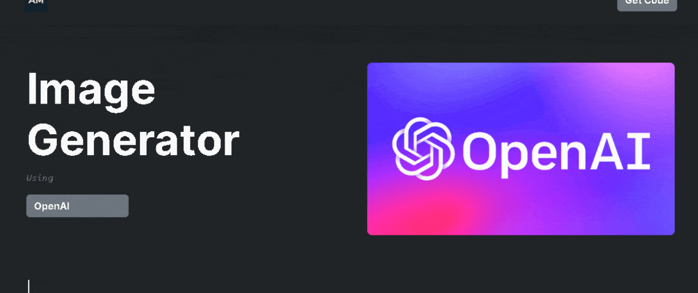
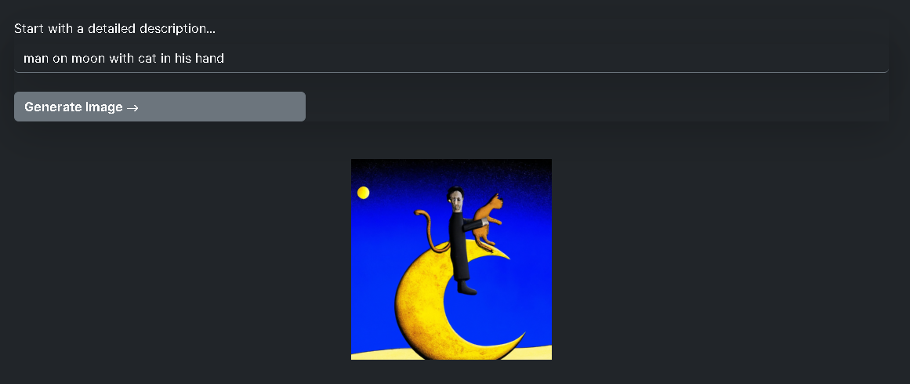
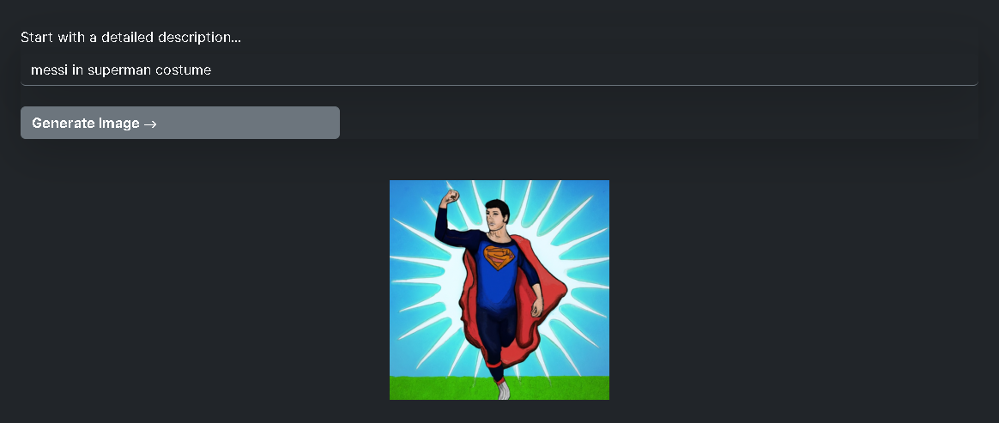
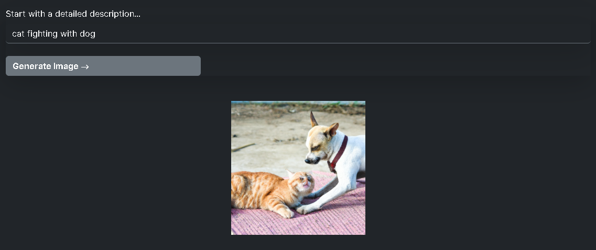

# MakeScene

Live project link: [https://makescene.com](https://openai-lac.vercel.app/).

📸 The **MakeScene - OpenAI-Image-Generator** allows you to create an image given a text prompt. Build using Node, Express, React & OpenAI APIs. The more detailed the description, the more likely you are to get the result that you or your end user want

## Screenshots






## How To Run the Project?

- Clone this repository into your local machine
  > git clone https://github.com/theakshaymore/openAI
- In the root of project directory, run following commands:

  - _(to start backend)_

    ```
    npm install
    npm start
    ```

  - _(to start frontend)_

    ```
    cd frontend
    npm install
    npm start

    ```

- Setup environment variables
  - create ".env" file in root directory
  - add following
  ```
   PORT=8000
   OPENAI_API_KEY='your key from openapi.com'
  ```
